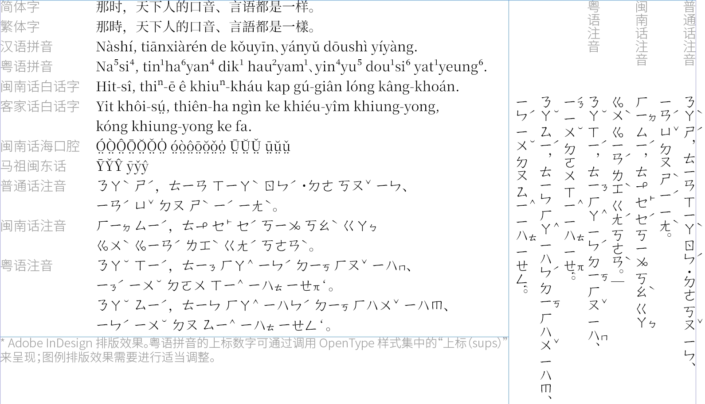
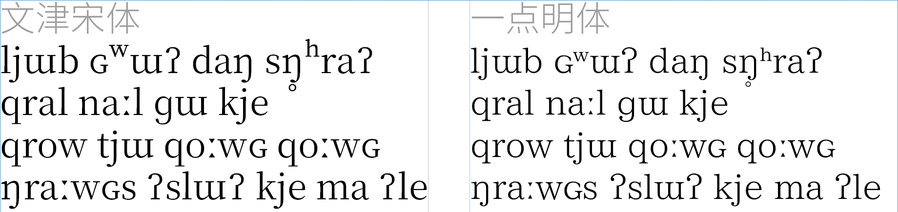
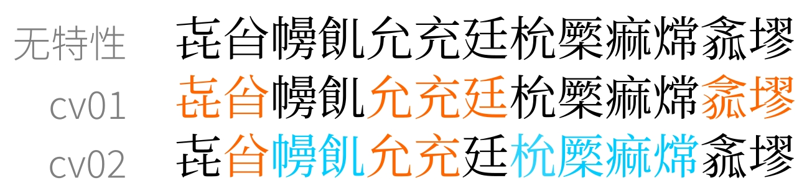
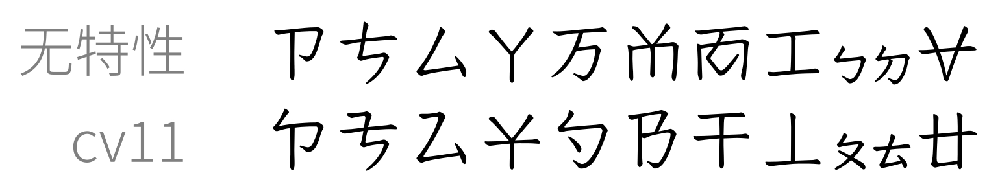
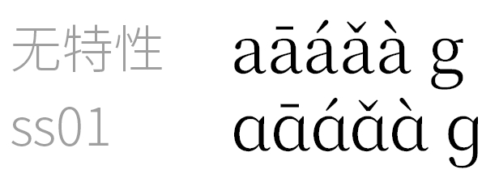
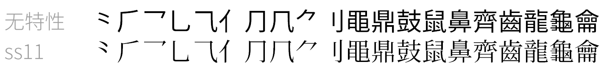
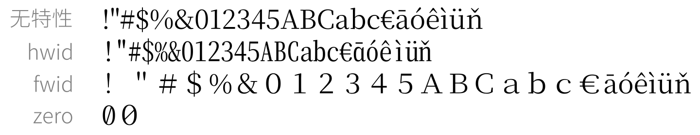

# 文津宋体（技术测试）
一套以[思源宋体](https://github.com/adobe-fonts/source-han-serif)及[修改版Kage引擎](https://github.com/ge9/kage-engine-2/)生成的汉字为主进行二次开发的大字符集宋体字库，字形主要以中国大陆地区字形标准呈现。
### WenJin Mincho (Technical test)
A large character set Songti(Mincho) fonts mainly derived by [Source Han Serif](https://github.com/adobe-fonts/source-han-serif) and Han glyphs generated by [modified Kage engine](https://github.com/ge9/kage-engine-2/), and the glyphs are mainly presented in China mainland glyphs standard(aka G source).

## 安装指南
- 三个单独的字体文件（otf或ttf后缀，下面会提到）与其对应的TTC字体包任选其一安装即可。二者字体数据和功能相同。
- Windows系统建议选择TTF版本安装（OTF版本在竖排时会存在一些问题）；
- macOS/Linux/FreeBSD等(类)Unix系统建议选择OTF版本安装。
### OTF字体文件（PostScript曲线）
- `otf/WenJinMinchoP[0|2|3]-Regular.otf` 三个单独的OpenType字体文件，每个文件包含对应平面的字符，数字代表平面编号。
- `ttc/WenJinMincho-OTF.ttc` 包含以上三个字体的整合包。
### TTF字体文件（TrueType曲线）
- `ttf/WenJinMinchoP[0|2|3]-Regular.ttf` 三个单独的TrueType字体文件，每个文件包含对应平面的字符，数字代表平面编号。
- `ttc/WenJinMincho-TTF.ttc` 包含以上三个字体的整合包。
### 安装到Windows系统，并作为系统回退字体

点击查看步骤

1. 下载TTF版字体文件（三个单独的ttf或者单个的TTF版ttc文件任选其一）；
2. 在资源管理器上选择字体文件，然后点击**鼠标右键→“为所有用户安装”（需要管理员权限，Win11用户还需要点击“显示更多选项”）**，安装字体文件；
3. 下载注册表文件`reg/WenJinMincho.reg`，双击合并（需要管理员权限），若出现安全警告请点击“运行”；
4. 注销（退出）并重新登录Windows系统账户，设置即可生效。若要删除字体，则仅需删除字体本体即可，注册表设置无需变动。
5. 更新字体后，仍需要注销（退出）并重新登录Windows系统账户方可生效。
6. 若安装/更新后选用本字体后发现无法正常显示（显示为方框）的情况，可尝试重新启动系统。

## 功能介绍
### ✅现今Unicode标准汉字和IVS全覆盖
- 包含现今Unicode标准（Version 15.1）定义的所有汉字（97,680统一汉字+1,002兼容汉字）及部分与汉字相关的符号，字体覆盖的汉字与符号已满足GB 18030-2022实现级别3所定义的范围；
- 包含现今Unicode标准（Version 15.1）定义的所有[标准异体序列（SVS）](https://www.unicode.org/versions/Unicode15.0.0/ch23.pdf#page=20)汉字字形（1,002个）和[表意文字异体序列（IVS）](https://www.unicode.org/reports/tr37/)字形（29,437个）；
> [!NOTE]
> **标准异体序列（SVS）字形及表意文字异体序列（IVS）字形的调用方法：** 
> 在基本汉字字符的后面再加对应的变体选择符（`U+FE00..FE0F,E0100..E01EF`）就可得到该异体字字形。
- CJK基本区、扩展A绝大部分、[通用规范汉字表](http://www.moe.gov.cn/jyb_sjzl/ziliao/A19/201306/t20130601_186002.html)全部和其他扩展区的部分汉字以中国大陆地区字形（即G源）呈现，并支持一部分汉字的假想G源[^1]（默认字形，支持假想G源的字符表请[点击这里查看](etc/fakeG.xlsx)）。
[^1]: 指Unicode标准中本不存在G源（即中国大陆字形标准）的字形来依照G源的写法来进行书写，使之达到G源的效果。
- 不存在G源且不支持假想G源的字形按照以下字形标准顺序呈现： 
$$\textbf{G}>\textbf{UK}>\text{UTC}>\text{H}>\text{M}>\text{T}>\text{J}>\text{K}>\text{KP}>\text{V}>\text{SAT}$$
### 🏗️支持汉语拼音等多种拼音、注音系统
- 支持汉语拼音、[闽南话白话字](https://zh.wikipedia.org/wiki/%E9%96%A9%E5%8D%97%E8%AA%9E%E7%99%BD%E8%A9%B1%E6%96%87)、[客家话白话字](https://zh.wikipedia.org/wiki/%E5%AE%A2%E8%AA%9E%E7%99%BD%E8%A9%B1%E5%AD%97)、[闽南话海口腔白话字](https://zh.wikipedia.org/wiki/%E6%B5%B7%E5%8D%97%E8%A9%B1%E7%99%BD%E8%A9%B1%E5%AD%97)、[马祖闽东话罗马字](https://zh.wikipedia.org/wiki/%E9%96%A9%E6%9D%B1%E8%AA%9E)等拼音系统（拉丁字母）字符显示；
- 支持普通话、[闽南话、客家话](https://zh.wikipedia.org/wiki/%E8%87%BA%E7%81%A3%E6%96%B9%E9%9F%B3%E7%AC%A6%E8%99%9F)、[粤语](https://zh.wikipedia.org/wiki/%E7%B2%B5%E8%AA%9E%E6%B3%A8%E9%9F%B3%E7%AC%A6%E8%99%9F)的注音符号显示（非普通话的注音符号尚未完全支持）。 
部分未收录至Unicode的注音符号可通过调用OpenType中的`cv11`/`subs`特性来调用。
- 本字体支持的拼音和注音系统参考：[一点明体功能记录8.100版](https://github.com/ichitenfont/I.Ming/blob/master/8.10/I.Ming_functional_report_8.100.pdf)
 
### 🏗️国际音标字符支持
- 支持国际音标字符的显示［组合用符号位置自动调节（mark、mkmk特性）尚未支持］。

### ✅字符异体/样式自由切换
> [!WARNING]
> 该部分特性并非所有软件都支持且支持良好，请注意甄别。例如：Microsoft Word不支持`cvXX`（字符异体）特性。详情请见：https://software.sil.org/fonts/features/
- `cv01`/`cv02`：通用规范汉字表字形（默认）与Unicode码表字形（`cv01`）、GB 18030-2022字形（`cv02`）自由切换（部分假想G标字形默认开启，启用`cv01`特性可关闭）；

- `cv11`：未收录至Unicode的部分注音符号；

- `ss01`：汉语拼音的手写体a、g；

- `ss11`：宋体形式的部首扩充/康熙部首；

- `cpct`：将标点放在中间位置（也可通过SVS来调用）；

- `hwid`/`fwid`/`zero`：半角/全角ASCII字符；数字零的斜线形式（也可通过SVS来调用）。

### ✅标点挤压支持
> [!WARNING]
> 该部分特性默认关闭，需要手动打开（Google Chrome/Chromium 123.0以上默认打开）。部分软件不支持此特性。
- `chws`/`halt`：标点挤压（同时也支持竖排版本的`vchw/vhal`）。

## 构建指南

点击以查看

本字体的构建源文件位于本存储库中的`source`文件夹内，在`source`文件夹内运行`build.sh`即可构建字体文件。高级用户和字体开发相关工作者可根据需要对源文件进行修改，来构建自定义版本。

在运行构建脚本之前，要确保您的设备已安装[AFDKO字体开发套件](https://github.com/adobe-type-tools/afdko)。在Windows系统中，还要检查您的设备已安装Bash shell，以运行Shell脚本（或自行改写成批处理脚本）。

## 字体授权
本字体以[SIL Open Font License（SIL开放字体协议）](https://openfontlicense.org/open-font-license-official-text/)授权形式发布。**任何个人、企业、团队等对本字体进行使用、复制、修改、分发等任意用途即视为您已完全阅读、充分理解并同意SIL Open Font License授权协议以及本说明文件中的“字体授权”这一小节的全部内容，并保证不作出任何异议，同时您还理解并同意：当您违反以下任意一条条款时将严格按照SIL Open Font License授权协议的有关规定进行处理，必要时作者可追究您的民事和/或刑事责任。**

[点击阅读SIL Open Font License授权协议（英文版）](LICENSE.md)

[点击阅读SIL Open Font License授权协议（中文翻译版）](LICENSE-zh.md)
### 您可以：
- 任何个人、团体、组织及企业可免费进行商业目的和非商业目的使用，无需支付费用、事先告知作者、标明来源信息或征得作者许可；
- 对字体文件进行二次发布或安装、嵌入到任何软件或设备中，同时软件或设备可被再次分发/销售（若制作仅以安装本字体为目的之安装包必须免费配布，不得进行付费盈利，否则视作字体倒卖/变相倒卖行为）；
- 对字体文件进行修改、扩充和格式转换，但修改过后的文件**必须以SIL Open Font License的授权形式**发表，同时**不得使用本字体的保留名称（以及它的其他语言的翻译形式）：WenJin Mincho、文津宋体**（若仅对源字体进行格式转换，不进行任何其他修改可继续使用该保留名称）。
### 您不可以：
- 对字体文件中的任何部分（包括但不限于字形、OpenType特性逻辑）进行倒卖兜售（或其变相付费等类似行为），包括但不限于：将字体文件单独售卖、与其他字体进行捆绑售卖、需付费办理特殊权限才可使用字体等；
- 将字体文件中的任何部分以非SIL Open Font License授权协议发表；
- 本文未列明的，但违反SIL Open Font License授权协议的其他行为；
- 利用本字体文件或其衍生品进行危害计算机系统正常进行的行为（包括但不限于在字体文件中嵌入计算机病毒、主观故意利用程序或系统存在的BUG来扰乱计算机系统的正常运作）；
- 将本字体用作违反当地法律法规的用途。
### 其他声明
- 作者不行使、未能及时行使或未充分行使SIL Open Font License授权协议所享有的合法权利，不应被视为放弃该权利，也不影响作者在将来行使该权利；
- 若SIL Open Font License授权协议存在其中一项或多项条款全部或部分被视为无效或不具有执行力或因不可抗力无法强制执行，并不损害SIL Open Font License授权协议其他条款的执行力；
- **本字体为免费商用字体，凡是需要付费或者使用/办理特殊权限来获得该字体的行为，都是诈骗行为，谨防上当受骗；**
- 本字体不包含任何政治意图、隐喻及目的，与一切政治活动无关。作者不承担用户使用该字体所产生的任何连带法律责任。

## 注意事项
- 尽管作者在制作字体时力图准确和易用性，但因技术、个人能力和精力有限，无法保证字体本身数据的准确性及预期呈现效果在您的设备是否能够完美复现。因此，作者不对本字体作任何明示或暗示的保证，同时作者不承担您使用该字体所产生的任何索赔、损害或可归责事由而来的任何责任，请用户谅解。如果您使用该字体时遇到问题，恳请尽快[向作者反馈](README.md/#联系方式)。
- 由于第2、3平面的多数1000ppem版本字形正处于制作阶段，故暂使用[SuperHan](https://github.com/takushun-wu/SuperHan)来填满字形（*PS：本字体项目的立意就是替代SuperHan*）。
- V源字形因无严格标准（[喃那宋](https://github.com/nomfoundation/font)在严格意义上不算为标准），故该字体的V源字形仅供参考。
- 部分不同编码的表意文字异体序列（IVS）字形在图形角度上几乎完全相同，为减少本字体的文件体积，故这些编码在字体文件中会映射到同一字形，微小的字形差异（不至于达到IVS层面分别编码）会被认同，请用户悉知。

## 其他内容（点击以查看）
**[更新日志](CHANGELOG.md)**

**[常见问题](FAQ.md)**

**[打赏支持/Sponsor me](DONATE.md)**

**[相关字体和资源](RELATED.md)**

## 问题反馈与联系方式
如您在使用本字体的过程中如有任何问题和建议，或者是添加假想G源（即中国大陆汉字写法）的汉字请求，欢迎大家向作者反馈。您可在GіtΗub或Gitee中对应项目中提交issue（严禁提交无关内容），也可以通过下列联系方式中进行反馈。

> [!IMPORTANT]
> 在进行反馈之前，请先查阅[常见问题文档](FAQ.md)和本项目的issue分区，查看是否存在重复。

> [!WARNING]
> 下面的GіtΗub链接在跳转前，请确保域名是“**g i t h u b . c o m**”（去掉字符间空格），本人无“重庆开源共创”旗下的GitCode平台账号，**从未主动且从未授权第三方**在GitCode平台上创建存储库。**严禁GitCode等代码托管平台在未经作者本人书面许可的情况下私自搬运本字体以及与之关联的SuperHan字体项目，否则作者将追究法律责任。**
### 本项目地址
- **【更新首发】GіtΗub：https://github.com/takushun-wu/WenJinMincho** **（请确保上面的是GіtΗub链接）**
- Gitee：https://gitee.com/takushun/WenJinMincho
### 联系方式
- GіtΗub：https://github.com/takushun-wu/ **（请确保上面的是GіtΗub链接）**
- Gitee：https://gitee.com/takushun/
- 邮箱
    * takushun-wuⓐoutlook●com
    * junny_2016ⓐqq●com
- Gmail：takushunwuⓐgmail●com
- QQ：②❽③❸⑨❹④❻①❸（添加好友请备注“**文津宋体问题反馈**”）
- 哔哩哔哩：https://space.bilibili.com/156861970
